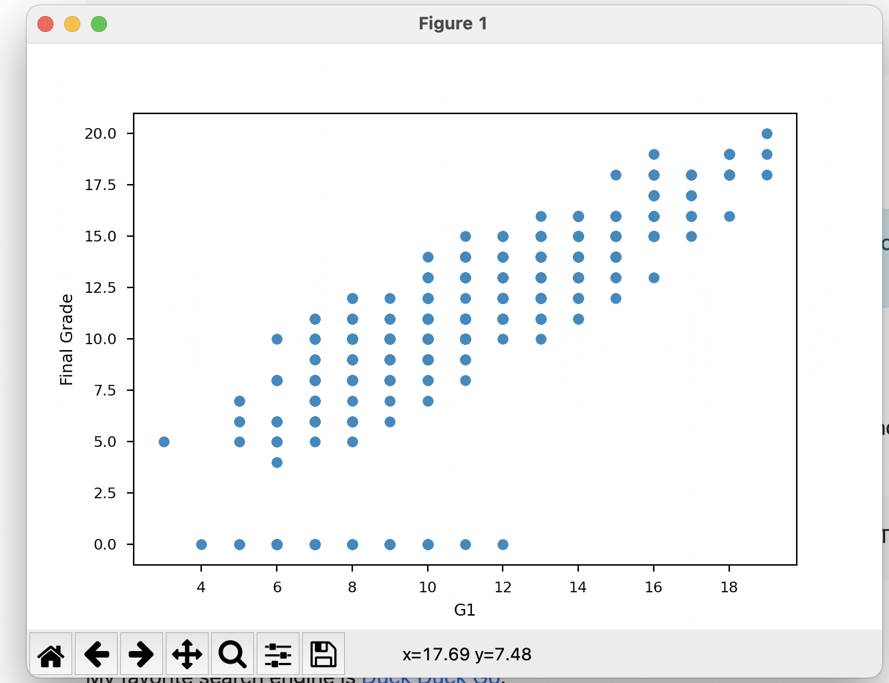

# Machine Learning Linear Regression

## Description

A simple machine learning linear regression implementation using Python

## Getting Started

### Dependencies

* pandas
* sklearn
* numpy
* matplotlib

### Whats inside the program

Data used for this implementation is [Student Performance](https://archive.ics.uci.edu/ml/datasets/Student+Performance) from **ics.uci.edu**

Running the project will generate the model **studendt-model.pickle** and also propmt a visualization of the algorithm using matplotlib.

### Project Output

## Authors

Contributors names and contact info

[Mark Ernrest R. Matute](https://github.com/MarkMatute)
